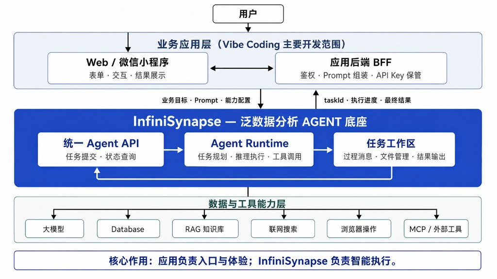
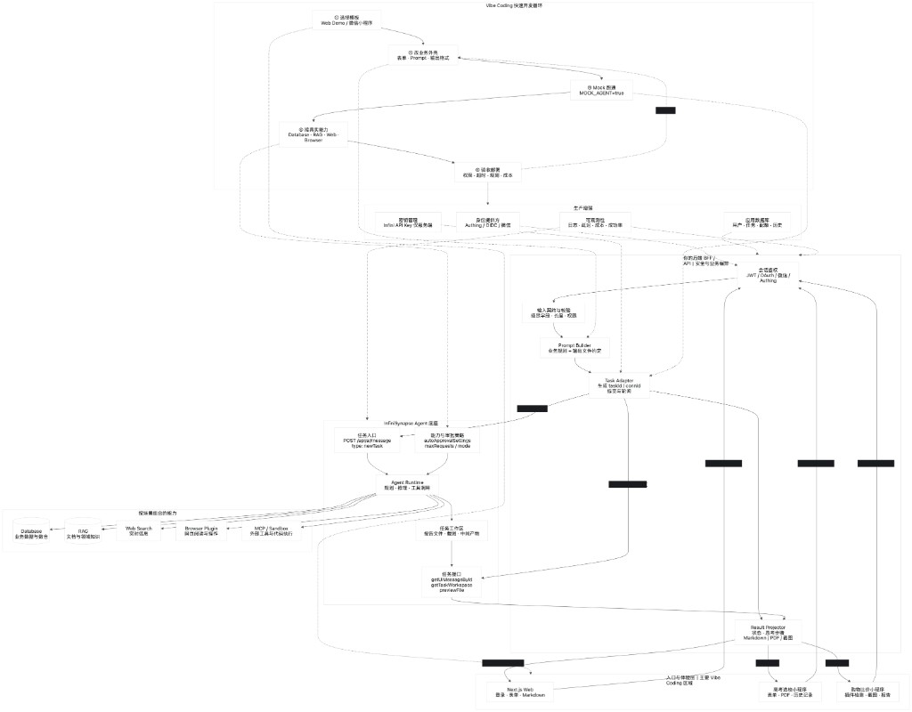

# 基于 InfiniSynapse 开发自己的应用

本仓库提供两套**可参考的接入示例**，帮助你把 InfiniSynapse（数据源 / RAG / Agent / 浏览器能力）接到自己的产品里：

| 目录 | 形态 | 用途 |
|------|------|------|
| [`web-demo/`](./web-demo) | 简化 Web 工程（Next.js） | **推荐先看**：鉴权 → 提交 Agent → 轮询结果的最小骨架 |
| [`exam-mini/`](./exam-mini) | 微信小程序 · 高考选校 | 小程序端接入示例（完整业务 UI） |
| [`shoping-mini/`](./shoping-mini) | 微信小程序 · 省钱比价 | 小程序端接入示例（登录 + 引导 + 购物任务） |

> InfiniSynapse 是 AI Agent 应用底座。你的应用只做「入口 / 交互层」，推理与工具调用由底座完成。

---

## 架构总览



*应用负责入口与体验；InfiniSynapse 负责智能执行。*

用户通过 Web / 小程序提交业务目标，你的 BFF 负责鉴权、Prompt 组装与 API Key 保管，再调用 InfiniSynapse 统一 Agent API；底座完成任务规划、推理执行与工具调用，并通过任务工作区返回进度与最终结果。

### Vibe Coding 快速开发闭环



*从参考模版 → 业务外壳 → 能力开关 → Mock 联调 → 生产部署的完整路径。*

本仓库对应图中左侧「参考模版」与底部「你的前端」；[`web-demo`](./web-demo) 与两个小程序示例可直接作为起点，按闭环补齐 BFF、Prompt、结果文件名与生产环境变量后即可上线。

**安全原则（开源与生产都适用）**

1. **API Key 只放服务端**（环境变量 / 密钥管理），永远不要下发到浏览器或小程序包。
2. 前端只持有「你自己的会话 Token」，由后端再换取 / 使用 InfiniSynapse API Key。
3. 不要使用共享 guest Key 做公开服务；按用户隔离额度与权限。
4. 本仓库 Demo 默认 `MOCK_AGENT=true`，零密钥可跑通；接真机时用你自己的 Key。

---

## 核心调用链

以 [`web-demo`](./web-demo) 为准（与官网小应用、`infini-proxy` miniapp 同构，已删减业务细节）：

```text
1. POST /api/auth/login          → 拿到会话 token
2. POST /api/demo/task           → 后端拼 Prompt，调用 InfiniSynapse newTask，返回 taskId
3. GET  /api/demo/task?taskId=   → 轮询工作区报告文件 / 消息状态
4. 前端渲染 resultContent（Markdown）
```

### 后端如何调用 InfiniSynapse

| 步骤 | 方法 | 路径 | 说明 |
|------|------|------|------|
| 提交 | `POST` | `{SERVER}/api/ai/message` | body: `{ type: "newTask", taskId, text, connId, autoApprovalSettings, chatSettings }` |
| 列文件 | `GET` | `{SERVER}/api/ai_task/getTaskWorkspace/:taskId` | 看是否已生成约定报告文件 |
| 读报告 | `POST` | `{SERVER}/api/ai_task/previewFile` | `{ taskId, fileName }` |
| 消息 | `GET` | `{SERVER}/api/ai_task/getUiMessageById?id=` | 思考过程 / 是否等待用户 |

请求头：

```http
Authorization: Bearer <INFINISYNAPSE_API_KEY>
Content-Type: application/json
x-lang: zh_CN
```

参考实现：[`web-demo/lib/agent-client.ts`](./web-demo/lib/agent-client.ts)  
对应生产代码来源：官网各 `app/api/*/route.ts`，以及 `infini-proxy` 的 `miniapp/shopping.util.ts`。

---

## 快速体验 Web Demo

```bash
cd web-demo
cp .env.example .env.local
npm install
npm run dev
```

浏览器打开 http://localhost:3010 ：

1. 输入任意用户名登录（Demo 会话）
2. 选一个示例需求并提交
3. 观察轮询与 Markdown 报告

接真实底座时，在 `.env.local` 设置：

```bash
MOCK_AGENT=false
DEMO_JWT_SECRET=<长随机串>
INFINISYNAPSE_API_KEY=sk-xxx
INFINISYNAPSE_SERVER=https://app.infinisynapse.cn   # 或你的私有部署
```

---

## 扩展步骤：从 Demo 到自己的应用

### 1. 换鉴权

Demo 使用本地签名会话（`lib/auth.ts`）。生产可替换为：

- Authing / OIDC / 企业 SSO
- 微信小程序 `code` 换会话（见 `shoping-mini` + 自建后端）

保持不变的一点：**前端只带你的 Bearer；Infini Key 留在服务端。**

### 2. 换 Prompt 与表单

把 `buildPrompt()` 换成你的业务提示词，把表单字段映射进 Prompt。官网参考：

- 高考选校：省份 / 科类 / 分数 / 位次 / 目标校 → 冲稳保报告
- 省钱比价：商品 / 预算 / 平台 → 比价与避坑报告

约定一个**结果文件名**（Demo 使用 `demo-agent-result.md`），轮询时优先读该文件。

### 3. 打开底座能力

在 `autoApprovalSettings` 中按需启用：

| 能力 | 字段 | 典型场景 |
|------|------|----------|
| 数据库 | `actions.useDatabase` | 高考分数线、业务数仓 |
| 知识库 RAG | `actions.useRag` | 报考经验、产品文档 |
| 联网搜索 | `enableWebSearch` | 尽调、资讯 |
| 浏览器插件 | `enableBrowser` | 购物比价、网页操作 |

数据源与 RAG 需在 InfiniSynapse 控制台先配置，并保证 API Key 所属账号已启用对应资源。

### 4. 获取 API Key

1. 注册 / 登录 InfiniSynapse（云端或私有部署）
2. 控制台创建 API Key（`sk-` 开头）
3. 仅写入服务端环境变量或密钥服务

CLI 也可管理任务与数据源，参见 InfiniSynapse 文档中的 `agent_infini`。

### 5. 小程序形态（可选）

本仓库两个小程序**保持原样**，可作为端侧 UI 参考：

- [`exam-mini/`](./exam-mini) — 高考选校（TypeScript）
- [`shoping-mini/`](./shoping-mini) — 省钱比价入口（JavaScript）

它们依赖各自后端（官网 `/api/mini/*` 或 `infini-proxy` `/api/miniapp/*`）。开源学习时请使用自己的 AppID / 后端，**不要提交小程序 Secret**。

---

## 仓库结构

```text
.
├── README.md                 # 本接入指南
├── docs/images/              # 架构示意图
├── LICENSE                   # MIT
├── web-demo/                 # 简化 Web 参考工程（优先阅读）
├── exam-mini/                # 微信小程序 · 高考选校
└── shoping-mini/             # 微信小程序 · 省钱比价
```

各子目录有独立 README，说明如何本地运行。

---

## 安全与开源清单

- [x] 默认 Mock，不包含真实 `sk-` / 微信 Secret / Authing Secret
- [x] `.env` / `.env.local` 已在 `.gitignore`
- [x] 提供 `.env.example` 占位说明
- [x] Demo JWT 密钥可配置；真实模式强制配置
- [x] 输入长度限制；错误日志不打印完整密钥
- [ ] 上线前：替换 Demo 登录、轮换密钥、配置 HTTPS 与域名白名单

---

## License

[MIT](./LICENSE)
